  <a href="STATS.md">🇬🇧 English</a> |
  <a href="https://translate.google.com/translate?sl=en&tl=pl&u=https://github.com/FirstEverTech/STATS.md">🇵🇱 Polski</a> |
  <a href="https://translate.google.com/translate?sl=en&tl=de&u=https://github.com/FirstEverTech/STATS.md">🇩🇪 Deutsch</a> |
  <a href="https://translate.google.com/translate?sl=en&tl=fr&u=https://github.com/FirstEverTech/STATS.md">🇫🇷 Français</a> |
  <a href="https://translate.google.com/translate?sl=en&tl=es&u=https://github.com/FirstEverTech/STATS.md">🇪🇸 Español</a> |
  <a href="https://translate.google.com/translate?sl=en&tl=pt&u=https://github.com/FirstEverTech/STATS.md">🇧🇷 Português</a> |
  <a href="https://translate.google.com/translate?sl=en&tl=nl&u=https://github.com/FirstEverTech/STATS.md">🇳🇱 Nederlands</a>
   
  <a href="https://translate.google.com/translate?sl=en&tl=zh-CN&u=https://github.com/FirstEverTech/STATS.md">🇨🇳 中文</a> |
  <a href="https://translate.google.com/translate?sl=en&tl=ja&u=https://github.com/FirstEverTech/STATS.md">🇯🇵 日本語</a> |
  <a href="https://translate.google.com/translate?sl=en&tl=ko&u=https://github.com/FirstEverTech/STATS.md">🇰🇷 한국어</a> |
  <a href="https://translate.google.com/translate?sl=en&tl=it&u=https://github.com/FirstEverTech/STATS.md">🇮🇹 Italiano</a> |
  <a href="https://translate.google.com/translate?sl=en&tl=tr&u=https://github.com/FirstEverTech/STATS.md">🇹🇷 Türkçe</a> |
  <a href="https://translate.google.com/translate?sl=en&tl=ar&u=https://github.com/FirstEverTech/STATS.md">🇸🇦 العربية</a> |
  <a href="https://translate.google.com/translate?sl=en&tl=hi&u=https://github.com/FirstEverTech/STATS.md">🇮🇳 हिन्दी</a> |
  <a href="https://translate.google.com/translate?sl=en&tl=ru&u=https://github.com/FirstEverTech/STATS.md">🇷🇺 Русский</a>

  
# FirstEver Technology / www.FirstEver.tech

# 📊 Stats

## 📥 GitHub Downloads

Lines: `Rep1` Universal-Intel-Chipset-Updater · `Rep2` Universal-Intel-WiFi-BT-Updater · `Rep3` Adobe-AVX2-Patch · `Total` (dashed)
Markers below axis = release dates.

## 🎯 PSGallery Downloads

Lines: `Rep1` · `Rep2` · Release markers for Rep1/Rep2 only.

## ⭐ Stars

Total daily stars across all repositories.

## 👥 Followers

## 👁️ Profile Views

Daily traffic on the profile README (last 31 days, sourced from GitHub traffic API — only 14 days of history available per API call, older days show 0).

## 🤝 Contribution

## 📘 Useful Links

[FirstEver Technology GitHub](https://github.com/FirstEverTech)  
[Universal Intel Chipset Device Updater](https://github.com/FirstEverTech/Universal-Intel-Chipset-Updater)  
[Universal Intel Wi-Fi and Bluetooth Drivers Updater](https://github.com/FirstEverTech/Universal-Intel-WiFi-BT-Updater)  
[Adobe AVX2 Patch](https://github.com/FirstEverTech/Adobe-AVX2-Patch)  

---

Author: Marcin Grygiel aka FirstEver ([LinkedIn](https://www.linkedin.com/in/marcin-grygiel))
